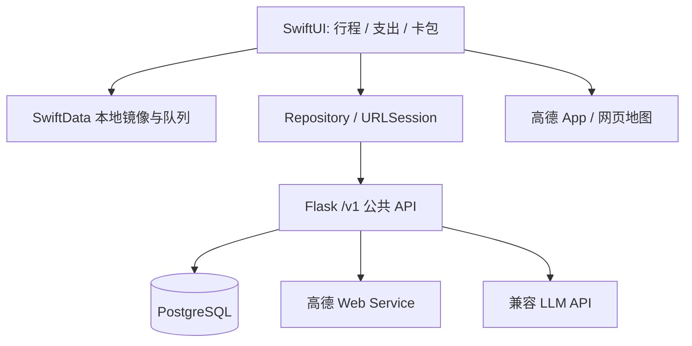
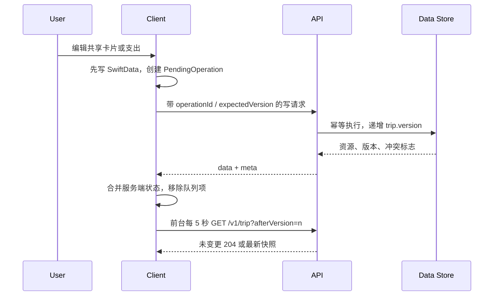

# Technical Design

**Based on:** `docs/product/PRD.md`, `docs/product/features/`

## Goal
交付一个围绕单一公开共享行程的 iOS 17+ 原生 App 与 Flask JSON API：两台设备可协作编辑行程和支出，卡包仅保存在创建它的设备。

## Confirmed Architecture
- Shape: 单体 iOS 客户端 + 单体 Flask REST API + PostgreSQL；不拆分微服务、队列、账号或后台。
- Frontend: `travel-companion-ios` 的 SwiftUI 页面、SwiftData 本地镜像与离线操作队列；地图外跳和剪贴板由客户端完成。
- Backend: `/Users/yangzhiyuan/nuanxinban/backend/biz-platform/travel-companion-api` 负责共享数据、冲突元数据、AI 与高德 Web Service 代理。
- Deployment: 开发期本机 Flask + PostgreSQL。生产位置、HTTPS 域名、数据库备份待配置；API 不以此文档进行部署或 DNS 变更。

## Confirmed Tech Stack
- Frontend: Swift 6、SwiftUI、SwiftData、URLSession、CryptoKit、Security/Keychain；最低 iOS 17。
- Backend: Python 3.9+、Flask 3.1、SQLAlchemy 2、psycopg（PostgreSQL 驱动）、pytest；Flask 应用工厂保持现有模式。
- Database/storage: PostgreSQL 保存唯一共享行程、地点、卡片、支出、幂等操作记录；SwiftData 保存共享镜像、路线缓存、待同步队列与卡包密文。Keychain 仅保存卡包 AES-GCM 密钥及本机设备 ID。
- Auth: 明确不做认证或授权。所有 `/v1` 共享资源均公开读写；客户端不得暗示数据私密。卡包无 API，绝不出设备。
- Build/release: XcodeGen 工程 + `xcodebuild` Debug 构建；后端通过 `.venv/bin/python -m pytest -q` 与 `/health` 验证。第三方密钥和生产 URL 由环境变量提供，不能进入仓库。

## System Architecture


## Data Flow


## Feature Index
| Feature | Design File | Summary | Dependencies |
| --- | --- | --- | --- |
| 唯一共享行程 | `docs/design/features/shared-itinerary.md` | 单例行程、日期时间轴、本地镜像与 CRUD | API、SwiftData |
| 旅行卡片 | `docs/design/features/travel-cards.md` | 机票、酒店、活动卡片与系统联动 | 行程、Place |
| 地图路线 | `docs/design/features/maps-routing.md` | 高德检索、距离时长与外部路线 | Place、后端代理 |
| 支出统计 | `docs/design/features/expenses.md` | 支出 CRUD、分类与双人结算 | 行程、同步 |
| 本机卡包 | `docs/design/features/local-wallet.md` | 加密本地号码、遮挡和复制 | SwiftData、Keychain |
| AI 填入行程 | `docs/design/features/ai-itinerary.md` | 后端生成结构化草案、确认导入 | 行程卡片、LLM 配置 |
| 双人协作 | `docs/design/features/collaboration.md` | 5 秒短轮询、离线队列和 LWW 提示 | 所有共享资源 |
| Pin Gooey 视觉调参 Demo | `docs/design/features/pin-gooey-demo.md` | SwiftUI Canvas 双 Pin 二维自由拖动、360° 轮廓、稳定数字成员过渡与实时参数面板 | 无业务依赖 |
| 首页 Pin 动态边界与聚合 | `docs/design/features/home-edge-pin.md` | resolver 唯一决定 placement；成员集合变化直接应用最新稳定 Pin | Today MapLibre、Core Animation |

## Today Map Pin Rendering Contract
- `calculatedPinPlacements` 及 regular/edge/final grouping resolver 是成员、代表、位置、标签和选择态的唯一真相；动态安全区、外框碰撞、方向槽、聚合滞回与自动追焦设计保持不变。
- Coordinator 每次计算后直接配置最新稳定 annotation views。成员集合 merge/split、快速缩放、自动追焦和安全区变化都不得创建 Gooey transition descriptor、metaball path、overlay、clarity snapshot、coalescer 或延迟 fallback。
- 保留非 Gooey 的普通位置过渡和指向角圆角插值；它们只作用于单个稳定 Pin，不连接两个 Pin、不隐藏 annotation 内容、不创建辅助功能副本。
- 独立 `GooeyPinDemoView` 是 App 内唯一 Gooey 渲染入口，只可复用静态颜色、尺寸和圆角 token，不得引用 MapLibre placement、resolver、annotation、POI、选择、相机或地图事件。完整首页约束见 `docs/design/features/home-edge-pin.md`。

## API Contracts
| Endpoint | Method | Auth | Request | Response | Errors |
| --- | --- | --- | --- | --- | --- |
| `/health` | GET | 无 | 无 | `{status:"ok",service:"travel-companion-api",database:"ok"}` | `503 database_unavailable` |
| `/v1/trip` | GET | 无（公开） | 可选 `afterVersion` | `200` 行程快照；未变更为 `204` | `500 internal_error` |
| `/v1/trip` | PATCH | 无（公开） | `destination,startDate,endDate,currency,expectedVersion,operationId` | 更新后的行程与 `meta` | `400 validation_error` |
| `/v1/days` | POST | 无（公开） | `date,position,expectedVersion,operationId` | Day 资源与 `meta` | `400 validation_error` |
| `/v1/days/{dayId}` | PATCH/DELETE | 无（公开） | PATCH 传 `date,position,...`；DELETE 传版本/操作 ID | 资源或 `{deleted:true}` + `meta` | `404 not_found` |
| `/v1/cards` | POST | 无（公开） | 卡片字段（含 `imageUrl`）、`expectedVersion,operationId` | Card 资源与 `meta` | `400 validation_error` |
| `/v1/cards/{cardId}` | PATCH/DELETE | 无（公开） | PATCH 卡片字段；DELETE 版本/操作 ID | 资源或删除结果 + `meta` | `404 not_found` |
| `/v1/expenses` | GET/POST | 无（公开） | POST 支出字段、版本/操作 ID | 列表或 Expense + `meta` | `400 validation_error` |
| `/v1/expenses/{expenseId}` | PATCH/DELETE | 无（公开） | PATCH 支出字段；DELETE 版本/操作 ID | 资源或删除结果 + `meta` | `404 not_found` |
| `/v1/places/search` | GET | 无 | `keyword`、可选 `city` | 高德标准化地点候选 | `400 validation_error`、`502 map_provider_error` |
| `/v1/routes/estimate` | POST | 无 | `origin{lat,lng},destination{lat,lng},mode` | `distanceMeters,durationSeconds,provider,updatedAt` | `400 validation_error`、`502 map_provider_error` |
| `/v1/ai/itinerary-drafts` | POST | 无 | `sourceText,startDate,days,preferences` | 不落库的结构化草案 | `400 validation_error`、`429 rate_limited`、`502 ai_provider_error` |
| `/v1/ai/link-import` | POST | 无 | `url`（小红书 `xiaohongshu.com` / `xhslink.com` 公开链接） | 单卡草案 `{kind,title,place,notes,imageUrl,url}`，`imageUrl` 为 `/v1/files/<name>`；原图下载后服务端托管 | `400 validation_error`、`429 rate_limited`、`502 upstream_unavailable`、`503 integration_unconfigured` |
| `/v1/files/{name}` | GET | 无 | 无 | 托管的卡片封面图（不可变，长缓存） | `404 not_found` |

所有 JSON 成功写响应使用 `{ "data": <resource>, "meta": { "tripVersion": 12, "operationId": "UUID", "conflict": false, "serverUpdatedAt": "ISO-8601" } }`。列表/快照的 `data` 为对象或数组。错误统一为 `{ "error": { "code": "validation_error", "message": "面向用户的简短中文说明", "requestId": "UUID", "details": [{"field":"amount","reason":"must_be_positive"}] } }`；不返回密钥、供应商原始错误或堆栈。`operationId` 为 UUID，服务端按其去重；`expectedVersion` 落后时仍按最后写入优先应用，返回 `meta.conflict=true`，以便本机提示覆盖风险。

## Data Model
| Entity | Fields | Ownership | Persistence | Notes |
| --- | --- | --- | --- | --- |
| `SharedTrip` | 固定 `id=1`、destination、startDate、endDate、currency、version、updatedAt | 公开共享 | PostgreSQL + SwiftData 镜像 | 不提供列表或创建多个行程 |
| `TripDay` | id、date、position、tripId、updatedAt | 公开共享 | PostgreSQL + 镜像 | 日期唯一；为空时仍可存在 |
| `Place` | id、name、address、latitude、longitude、amapId、updatedAt | 公开共享 | PostgreSQL + 镜像 | 无坐标地点不能请求路线 |
| `ItineraryCard` | id、dayId、kind、title、startAt、endAt、placeId、bookingCode、url、imageUrl、notes、position、updatedAt | 公开共享 | PostgreSQL + 镜像 | `kind` 仅 `flight`、`hotel`、`activity`；`imageUrl` 为服务端托管的 `/v1/files/<name>`，不存第三方 CDN 签名 URL |
| `Expense` | id、amountMinor、currency、category、paidBy、splitMode、occurredOn、note、cardId、updatedAt | 公开共享 | PostgreSQL + 镜像 | 金额为最小货币单位整数；`splitMode` 为 `equal` / `self` |
| `AppliedOperation` | operationId、resourceType、response JSON、createdAt | 服务端内部 | PostgreSQL | 仅保留必要时间（如 30 天），用于重试幂等 |
| `DeviceProfile` | localDeviceId、displayName、lastSeenAt | 本机，显示名可随写请求上报 | Keychain/SwiftData；服务端不需要成员表 | 最多两台是产品目标，不强制或认证 |
| `PendingOperation` | id、method、path、body、baseVersion、createdAt、retryCount | 本机 | SwiftData | 绝不包含卡包；网络恢复按创建顺序重放 |
| `RouteEstimate` | origin/destination 坐标哈希、mode、distance、duration、updatedAt | 本机缓存 | SwiftData | 仅缓存，过期（15 分钟）再查服务端 |
| `LocalWalletItem` | id、label、ciphertext、noteCiphertext、createdAt、updatedAt | 仅本机 | SwiftData + Keychain AES 密钥 | 不建 API/DTO/日志字段；开启完整文件保护 |

## Directory Plan
```text
/Users/yangzhiyuan/Documents/indo/travel-companion-ios/
  Sources/TravelCompanion/
    App/TravelCompanionApp.swift
    Core/{AppConfiguration,APIClient,APIModels,SyncEngine,KeychainStore}.swift
    Data/{SharedModels,WalletModels,Repositories}.swift
    Features/{Itinerary,Cards,Expenses,Wallet,Maps,AI,Settings}/
    UI/{Components,Theme}/
  Tests/TravelCompanionTests/
  docs/design/

/Users/yangzhiyuan/nuanxinban/backend/biz-platform/travel-companion-api/
  app/{__init__,config,extensions,models,schemas,errors}.py
  app/routes/{health,trip,cards,expenses,maps,ai,files}.py
  app/services/{sync,maps,ai,link_import}.py
  tests/{test_health,test_trip,test_cards,test_expenses,test_maps,test_ai,test_link_import}.py
  requirements.txt
```

## Verification Plan
- Unit/lint/type checks: iOS 使用 `xcodebuild -project TravelCompanion.xcodeproj -scheme TravelCompanion -sdk iphonesimulator -destination 'platform=iOS Simulator,name=iPhone 15' test`；后端使用 `./.venv/bin/python -m pytest -q`。若添加 linter，仅在项目配置后运行，避免引入空配置。
- Frontend smoke: `xcodebuild -project TravelCompanion.xcodeproj -scheme TravelCompanion -sdk iphonesimulator -destination 'platform=iOS Simulator,name=iPhone 15' build`，在模拟器打开三栏 Tab、创建卡片与本机卡包。
- Backend health: 在后端目录执行 `./.venv/bin/python run.py`，另开终端 `curl -fsS http://127.0.0.1:5058/health`；PostgreSQL 未配置时健康检查应明确 `503`，不可假装可用。
- Integration: 用两个模拟器/真机和同一 API，验证新增卡片 5 秒内可见、离线队列恢复、并发覆盖提示、路线网页回退、AI 取消不写库、卡包网络抓包无泄露。
- Release: 不在本阶段发布。发布前配置 `DATABASE_URL`、`APP_ENV=production`、`CORS_ALLOWED_ORIGINS`、`AMAP_WEB_SERVICE_KEY`、`AI_API_BASE_URL`、`AI_API_KEY`、`AI_MODEL`，配置 HTTPS 和数据库备份，再进行双机人工验收。

## Implementation Order
1. 扩展 Flask 配置、SQLAlchemy、迁移策略（MVP 可使用显式 `flask db`/Alembic）和统一错误/健康检查；定义共享 JSON DTO。
2. 实现单例行程、日期、卡片、支出 CRUD 与操作幂等/版本元数据，先由 API 测试锁定契约。
3. 搭建 iOS 共享数据模型、APIClient、SwiftData 镜像和 SyncEngine，完成行程主时间轴。
4. 完成三类卡片、支出表单/统计和冲突/离线状态 UI。
5. 加入高德地点/路线代理、客户端外部地图跳转及缓存。
6. 加入 AI 草案 API、预览编辑和确认批量写入。
7. 加入无网络依赖的加密本机卡包；完成全链路与双设备 QA。

## Risks And Manual Checkpoints
- 公共 API 是用户明确选择，但任何知道地址的人都可能读取和篡改共享数据；生产只允许非敏感行程数据、HTTPS、限流、输入限制与受限 CORS，仍不构成访问控制。
- 高德 API 与外部 App URL Scheme 需要真机和有效 Key 验证；未安装 App 必须使用网页回退。
- AI 提供商、模型、预算和跨境合规未定；以兼容 HTTP 适配层和环境变量隔离，密钥/原文不入日志。
- 首次目的地、日期、币种和显示名可在首次进入的单例行程设置中填写；不能生成第二份行程。
- 钱包 MVP 不启用 Face ID；因无云备份，卸载 App 或丢失 Keychain 密钥会导致卡包不可恢复，应在 UI 明示。
